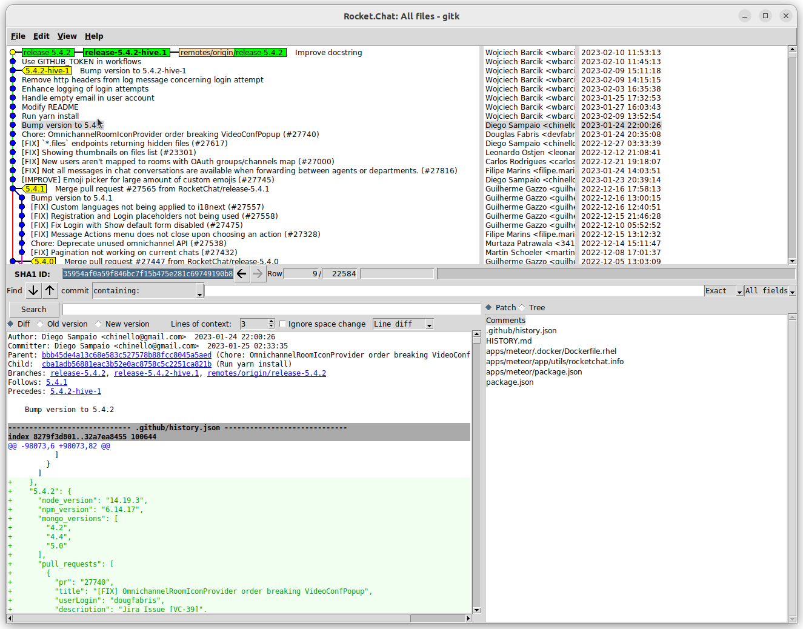

## Install application from Github Workflow Artifacts

You need Github Personal Access Token, see
[guide on Github](https://docs.github.com/en/authentication/keeping-your-account-and-data-secure/creating-a-personal-access-token).
Export it as environment variable `GITHUB_TOKEN`. Then do something like this:

```bash
cd /tmp ;
mkdir -p rocket-chat-build ;
cd rocket-chat-build ;
```

Get artifact ID from Github UI manually, see example link from UI
https://github.com/openhive-network/Rocket.Chat/suites/10616079470/artifacts/529787943
– artifact ID is the last part in URL.


Alternatively list artifacts via API and look for your artifact ID in
response:
```bash
curl \
    -H "Accept: application/vnd.github+json" \
    -H "Authorization: Bearer ${GITHUB_TOKEN}"\
    -H "X-GitHub-Api-Version: 2022-11-28" \
    https://api.github.com/repos/openhive-network/Rocket.Chat/actions/artifacts
```

Download artifact (replace `<artifact-id>` with your artifact ID):
```bash
export ARTIFACT_ID="<artifact-id>" ;
curl \
    -H "Accept: application/vnd.github+json" \
    -H "Authorization: Bearer ${GITHUB_TOKEN}"\
    -H "X-GitHub-Api-Version: 2022-11-28" \
    --location --output rocket-chat-artifacts.zip \
    "https://api.github.com/repos/openhive-network/Rocket.Chat/actions/artifacts/${ARTIFACT_ID}/zip" ;
```

Unpack artifact (you need `unzip` command working on your system):
```bash
set +e ;
unzip rocket-chat-artifacts.zip ;
rm rocket-chat-artifacts.zip ;
tar xzf Rocket.Chat.tar.gz ;
rm Rocket.Chat.tar.gz ;
set -e ;
```

Follow guide [Rocket.Chat on
Ubuntu](https://docs.rocket.chat/deploy-rocket.chat/prepare-for-your-rocket.chat-deployment/other-deployment-methods/manual-installation/debian-based-distros/ubuntu)
to start Rocket Chat from terminal.

Alternatively run application in a docker container. Copy or create
Dockerfile alongside unpacked `bundle` directory. You can find
appropriate Dockerfile in repository, for instance here:
https://github.com/openhive-network/Rocket.Chat/blob/feat/allow-user-with-empty-email/apps/meteor/.docker/Dockerfile.
Then build docker image like this:
```bash
docker build -t bamboo/rocket-chat:4.8.7 .
```


## Create release

Push the code for release to Github. Remember to use option
`--no-verify`, to avoid running any checks locally.

Create a release on Github, see [Managing releases in a
repository](https://docs.github.com/en/repositories/releasing-projects-on-github/managing-releases-in-a-repository).
Create git tag in Github UI, when creating release there.

Build application on your local development machine and prepare release
package:
```bash
set +e ;
cd apps/meteor/ ;
meteor build --server-only --directory /tmp/rocket.chat ;
cd /tmp/rocket.chat ;
tar czf /tmp/rocket.chat.tgz bundle ;
cd /tmp ;
rm -rf rocket.chat/ ;
set -e ;
```

Upload the file `/tmp/rocket.chat.tgz` as a release asset (binary) to
Github, either via UI or via
[API](https://docs.github.com/en/rest/releases/assets?apiVersion=2022-11-28#upload-a-release-asset).
See example API requests below.

Get release ID (look for it in json response):
```bash
curl \
    -H "Accept: application/vnd.github+json" \
    -H "Authorization: Bearer ${GITHUB_TOKEN}"\
    -H "X-GitHub-Api-Version: 2022-11-28" \
    https://api.github.com/repos/openhive-network/Rocket.Chat/releases
```

Upload a file (replace `<release-id>` with your release ID) as a release
asset:
```bash
export RELEASE_ID="<release-id>" ;
curl \
    -X POST \
    -H "Accept: application/vnd.github+json" \
    -H "Authorization: Bearer ${GITHUB_TOKEN}"\
    -H "X-GitHub-Api-Version: 2022-11-28" \
    -H "Content-Type: application/octet-stream" \
    "https://uploads.github.com/repos/openhive-network/Rocket.Chat/releases/${RELEASE_ID}/assets?name=rocket.chat.tgz" \
    --data-binary "@rocket.chat.tgz" ;
```

Alternatively you can do the same by downloading relevant Github
Workflow artifact (see section above) and upload it as a release asset.

## Syncing fork on development machine

See [guide about syncing
fork](https://docs.github.com/en/pull-requests/collaborating-with-pull-requests/working-with-forks/syncing-a-fork#syncing-a-fork-branch-from-the-command-line).

Preliminary step (do once);
```bash
git remote add upstream git@github.com:RocketChat/Rocket.Chat.git ;
```

We need to sync branch `master`, usually. Everything related to
releases is kept in this branch on upstream:
```bash
git checkout --track origin/master || git checkout master ;
git pull ;
git fetch upstream ;
git merge upstream/master ;
git push --no-verify ;
```

## Applying Hive patch onto upstream release

You need to have working development environment on your machine, see
project's main README. I recommend to install [Volta](https://volta.sh/)
on your machine, instead of [nvm](https://github.com/creationix/nvm)
recommended in main README.

Assuming you want to modify code in upstream release `5.4.3` and create
Hive release `5.4.3-hive.1`.

Fetch everything:
```bash
git fetch --all
```

Ensure that tag `5.4.3` exists:
```bash
git tag --list | grep 5.4.3
```
When this doesn't find anything, something goes wrong. Maybe you need to
sync fork or the tag doesn't exist on remote.

See [answer by Enrico Campidoglio](https://stackoverflow.com/a/29916361)
or [article by Agnieszka
Małaszkiewicz](https://womanonrails.com/git-rebase-onto) to learn about
`git rebase --onto` quickly. We're going to do `git rebase --onto
<newparent> <oldparent> <until>` later. Basically we're going to put a
range of commits with our code, onto `master` branch at specific commit.

Get commit which tag `5.4.3` points to:
```bash
git rev-list -n 1 5.4.3
```
Write down the output somewhere, e.g.
`35705ae0928fde4d08e5156dbb61642577de28f0`. It's our `newparent`.

Go to branch, where you have the code you want to apply:
```bash
git checkout release-5.4.2-hive.1
```

Identify the first (oldparent) and the last (until) commit you want to
apply. Note that `oldparent` won't be applied – it's the last common
commit in branch `master` and yours. You can do this visually with gitk:
```bash
gitk &
```

See relevant screen shot:



In my case the first commit (oldparent) is
`35954af0a59f846bc7f15b475e281c69749190b8` (Bump version to 5.4.2), and
the last commit (until) is `c544ec7346f6a81a77832baca8803f99953a8e69`
(Improve docstring).

Do rebase:
```bash
git rebase --onto \
    35705ae0928fde4d08e5156dbb61642577de28f0 \
    35954af0a59f846bc7f15b475e281c69749190b8 \
    c544ec7346f6a81a77832baca8803f99953a8e69
```
Resolve merge conflicts, if any.

You're in detached HEAD now, so you need to create a new branch:
```bash
git checkout -b release-5.4.3-hive.1
```

Install yarn dependencies:
```bash
yarn install --frozen-lockfile
```
Test whether you can start application in development mode, and whether
you can confirm that our code behave as expected. Reorganize existing
commits or add new commits, if you need.

Bump version to `5.4.3-hive.1`, when you're done. You need to modify
following files, see earlier commits doing similar thing:

- package.json
- apps/meteor/package.json
- apps/meteor/.docker/Dockerfile.rhel
- apps/meteor/app/utils/rocketchat.info
